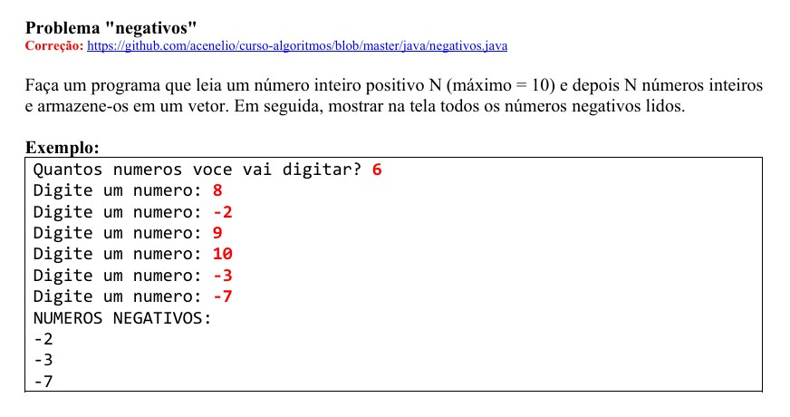

# Exercício 4.1 - Curso Udemy (Java)

## 📋 Descrição do Exercício
Este exercício tem como objetivo praticar o uso de **vetores e estruturas condicionais** em Java, por meio de um programa que lê N números inteiros e exibe apenas os números negativos.

## 🧠 O Que Foi Feito
Foi desenvolvido um programa que:
1. Lê a quantidade de números que o usuário deseja digitar (máximo 10).
2. Solicita a entrada de N números inteiros.
3. Armazena todos os números em um vetor.
4. Exibe apenas os valores negativos inseridos.

## 📁 Estrutura do Projeto
- `src/main.java`: contém a lógica principal:
  - Leitura com `Scanner`
  - Armazenamento em vetor `int[]`
  - Estrutura de repetição `for` para verificação de números negativos

## 🛠️ Tecnologias e Ferramentas
- Linguagem: **Java**
- IDE recomendada: **Eclipse**

## ▶️ Como Executar
1. Importe o projeto no Eclipse.
2. Execute a classe `main.java`.
3. Digite a quantidade de números e os valores solicitados.

## 📚 Conceitos Envolvidos
- Vetores (`int[]`)
- Estruturas de repetição e decisão (`for`, `if`)
- Entrada de dados com `Scanner`