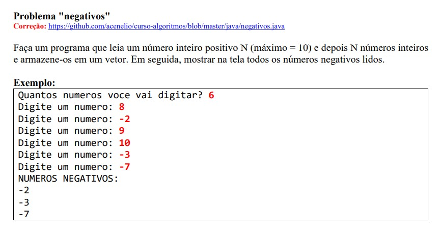

# Exercício 4.2 - Curso Udemy (Java)

## 📋 Descrição do Exercício
Este exercício foca em manipulação de **vetores paralelos** e cálculos estatísticos simples. O programa lê o nome, idade e altura de até 10 pessoas e apresenta informações processadas a partir desses dados.

## 🧠 O Que Foi Feito
Foi desenvolvido um programa que:
1. Lê a quantidade de pessoas (até 10).
2. Armazena nome, idade e altura de cada uma em vetores.
3. Calcula e exibe:
   - A altura média.
   - A porcentagem de pessoas com menos de 16 anos.
   - Os nomes das pessoas com menos de 16 anos.

## 📁 Estrutura do Projeto
- `src/main.java`: contém a lógica principal:
  - Vetores `String[]`, `int[]`, `double[]` para armazenar os dados.
  - Cálculo de média e porcentagem.
  - Impressão condicional de nomes com base na idade.

## 🛠️ Tecnologias e Ferramentas
- Linguagem: **Java**
- IDE recomendada: **Eclipse**

## ▶️ Como Executar
1. Importe o projeto no Eclipse.
2. Execute a classe `main.java`.
3. Insira os dados de cada pessoa quando solicitado.

## 📚 Conceitos Envolvidos
- Vetores múltiplos (paralelos)
- Operações matemáticas (média, porcentagem)
- Estrutura de repetição `for`
- Condicionais `if`
- Entrada de dados com `Scanner`